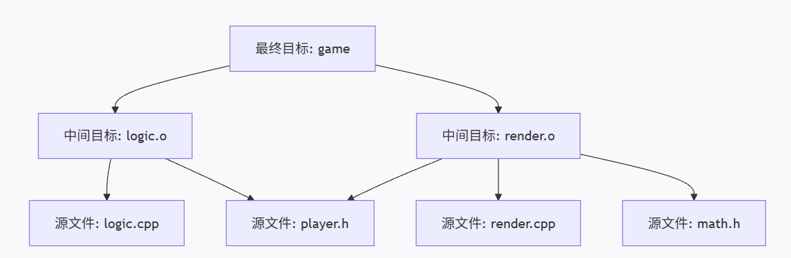

> ## All problems in computer science can be solved by another level of indirection
>
> <p style="text-align: right;">——David Wheeler</p>
## 写在前面

掌握 CMake，是代码从单文件“程序”走向工程化“项目”的必经之路。 本文旨在为初学者提供一个宏观的引入，粗略讲解Make 与 CMake 的发展历史与底层运行原理，帮助知其所以然。至于具体的语法细节与进阶指令，则不做过多展开——毕竟网上已有大量优秀的实战教程，前人之述备矣。

## 从单文件到多文件编译引发的问题

当我们写完程序后，我们会通过编译来生成可执行文件。在只有一个源文件的情况下，直接调用 `g++` 这样的底层编译器就能轻松搞定构建

``` bash
$ g++ -std=c++17 -Wall main.cpp -o app
```

然而真正的项目基本上都是由许多文件组成的，如果还是单纯的直接用g++来编译会引发几个问题：

### 1. 增量编译与头文件依赖管理的互斥

当你修改了几个文件后再次编译时，只能选择：1全部重新编译，2：精确的找出所有 *修改的文件* 和 *依赖修改过的文件的其他文件* 来将他们重新编译


- **全量编译导致时间膨胀**：如果项目编译需 10 分钟，修改单个逻辑文件后依然需要等待完整的 10 分钟。
    
- **手动增量引发依赖失控**：若仅手动编译改动过的源文件以节省时间，开发者必须在脑中人工维护复杂的头文件依赖网（DAG）。若修改了底层数据结构的头文件，却遗漏了重新编译某个包含该头文件的源文件，会导致链接产物存在不同的内存布局认知，从而引发极难排查的运行时段错误（Segmentation Fault）。

>**示例**：修改了 `player.h` 中的角色结构体大小。开发者重新编译了 `logic.cpp`，却忘记重新编译同样包含了 `player.h` 的 `render.cpp`。链接器不会报错，但程序会在运行时崩溃。


### 2. 静态链接时的严格拓扑顺序要求

将对象文件（`.o`）与静态依赖库打包时，大多数链接器（如 GNU `ld`）遵循单遍、从左至右的符号解析机制。这要求被依赖的底层模块必须位于调用者的右侧，否则链接器会因找不到需求而丢弃底层符号，最终抛出 `undefined reference` 错误。 在包含数十个交叉依赖库的现代项目中，人工梳理正确的链接顺序拓扑是不现实的。

> **示例**：`network.o` 调用了 `libcrypto.a` 的函数。若将指令写为 `g++ -lcrypto network.o`，链接器在扫描加密库时因未发现符号需求将其丢弃，随后在扫描网络模块时报错。正确的顺序必须是 `g++ network.o -lcrypto`。

### 3. 指令长度膨胀与高维护成本

现代 C++ 项目依赖大量第三方库和编译参数。当包含路径（`-I`）、库搜索路径（`-L`）、链接库名（`-l`）及编译选项（如优化等级和语言标准）线性增加时，编译指令会膨胀至数百字符。这种硬编码指令极易因拼写错误或字符遗漏导致构建失败，且难以进行版本控制。

> **示例**：引入外部依赖后，基础的编译指令可能膨胀为： `g++ src/main.cpp src/net.cpp -I./include -I/usr/local/include/opencv4 -L/usr/local/lib -lopencv_core -lboost_system -O3 -std=c++17 -Wall -o bin/app`。维护此类指令极度脆弱。

### 4. 缺乏环境抽象导致跨平台构建失效

原生编译指令往往与具体的操作系统环境及文件路径深度绑定。一旦开发环境变更（如从 macOS 迁移至 Linux），因依赖库的系统默认安装路径不同，原有的构建指令将直接失效。这打破了代码的跨平台一致性，增加了团队协同排查环境差异的开销。

> **示例**：Mac 开发者在指令中硬编码了通过 Homebrew 安装的库路径 `-L/opt/homebrew/lib`。当该指令在 Ubuntu 开发者的环境中执行时，由于 Linux 库通常位于 `/usr/lib/`，编译器将报错“找不到库文件”。


---

为了解决上述问题，人们开发了**自动化构建系统（Build Systems）**。本文就其中经典的 make & cmake 做简要介绍。

## Make

### Make的诞生

1976年，贝尔实验室的研究员 [Stuart Feldman](https://en.wikipedia.org/wiki/Stuart_Feldman) （他也是最早的Fortran 77 编译器的作者）正在排除一个由于经典的依赖缺失引发的bug：他同事在手动编译时，漏掉了一个本该重新编译的依赖对象文件（`.o`）。最后程序跑起来，新旧代码混合在一起，引发了严重的错误，白白浪费了他们好几个小时的时间。

Feldman 意识到，让程序员去手动管理文件之间的依赖关系，不仅低效，而且是反人类的。**机器应该干机器该干的事**。于是在那个周末，Feldman 闭门造车，写出了第一版 `Make`。

### Make的核心：图与时间戳

#### 图

Make引入了名为`makefile`的配置文件，在这里面声明程序的**依赖关系**。
Make的基础语法结构如下：
``` makefile
(Target) : (Prerequisites)
	(Command)
```

+ **Target** ：这条规则要生成的结果。通常情况下，它是一个真实的文件名（比如可执行文件 `app`，或者对象文件 `main.o`）。 但它也可以是一个“动作名称”（被称为**Pseudo-target**），比如 `clean`（清理文件）、`install`（安装程序）、`test`（运行测试）。当你执行 `make clean` 时，Make 并不是要生成一个名为 clean 的文件，而是去执行 clean 下面挂载的命令。
+ **Prerequisites**：生成 Target 所需要的前置条件，多个依赖之间用空格隔开。
+ **Command** ：要交给操作系统 Shell 去执行的具体指令。

同时 `makefile` 还可以指定一些编译参数如路径、编译标准等。

>示例：

``` makefile
# ==========================================
# 1. 集中管理环境参数（变量定义区）
# ==========================================
# 指定编译器
CXX = g++

# 编译参数：
CXXFLAGS = -std=c++17 -Wall -O3 -I./third_party/include

# 链接参数 (Linker Flags)：
LDFLAGS = -L./third_party/lib -lphysics_engine

# ==========================================
# 2. 图的节点与构建规则
# ==========================================
# 根节点：可执行文件 game
# 拓扑排序的最后一步：链接所有的 .o 文件和依赖库
game: logic.o render.o
	$(CXX) logic.o render.o $(LDFLAGS) -o game

# 中间节点 1：逻辑模块 
# 使用 $(CXX) 和 $(CXXFLAGS) 替代硬编码的 g++ 命令
logic.o: logic.cpp player.h
	$(CXX) $(CXXFLAGS) -c logic.cpp

# 中间节点 2：渲染模块
# 如果 player.h 或 math.h 被修改，本模块将被重新编译
render.o: render.cpp player.h math.h
	$(CXX) $(CXXFLAGS) -c render.cpp
```

当使用make命令时，它会读取`makefile`并将其解析为一张**有向无环图**，用拓扑排序进行编译顺序处理。



>图中箭头为依赖方向（game依赖logic.o），编译时从底层开始构建

#### 时间戳
每个文件都有一个最后修改时间（时间戳），当make检查一条规则时，它会对比 **target** 和 **Prerequisites** 的时间戳：
1. **如果目标文件不存在**，执行命令生成它。
2. **如果任意一个依赖文件的时间戳，晚于（大于）目标文件的时间戳**，说明依赖被修改过了，目标已经“过时”，立刻执行命令重新生成目标。
3. **如果目标文件的时间戳比所有依赖都晚**，Make 会输出一句：_“`target` is up to date”_，并直接跳过，从而节省大量编译时间。

### Make的局限性
结合上文的例子说明：
1. **依赖树的维护依旧半人工**：依然要手动写出`logic.o`, `logic.cpp`, `player.h`
2. **无法跨平台**：`clean`里面写`rm -f *.o app` 无法在windows上运行。
3. **第三方库路径硬编码**：我们将物理引擎库的路径硬编码成了 `-I./third_party/include` 和 `-L./third_party/lib`，但不同机器上路径可能不同。

所以后来人们又开发了`CMake` (Cross-platform Make)

---
## CMake
面对跨平台环境差异和极难维护的底层依赖，工程师们意识到：**连写 Makefile 这件事本身，也必须被自动化。**(懒惰是科技第一动力（误）)

### CMake的诞生

2000 年，美国国家医学图书馆委托 Kitware 公司开发一个庞大的开源医学图像处理库（ITK）。这个项目有一个硬性指标：必须同时在各种 Unix 系统和 Windows 上完美编译。当时业界的主流工具（如 GNU Autotools）在 Windows 下表现极差。为了解决这个痛点，Kitware 的 Bill Hoffman 决定从零开发一款全新的工具，这就是 **CMake**。

不同于Make主要负责编译，CMake本身负责读取一份高度抽象的项目描述文件 `CMakeLists.txt`，探测当前的系统环境，然后为你自动生成对应平台的底层构建文件：
+ Linux下默认生成 `Makefile`，交由Make执行
+ Windows下默认生成 Visual Studio的`.sln`工程文件交由MSBuild执行
+ 在现代大型工程中，通常生成build.ninja文件，交由构建速度极快的[`Ninja`](https://ninja-build.org/)执行

### CMake的优势
1. **自动化的依赖推导**

在 CMake 中，你再也不用手动去写类似 `logic.o: logic.cpp player.h` 这样的精细依赖规则。CMake 在生成阶段，会自动利用底层编译器（如 GCC 的 `-M` 特性）提取所有的 `#include` 头文件依赖网，并将其静默配置到生成的 Makefile 或 Ninja 文件中。

> **示例**：即使你在 `player.h` 中新增了一个嵌套的 `#include "math.h"`，你也不需要修改任何 CMake 代码，下一次构建时 CMake 会自动感知并更新依赖图。

2. **真正的跨平台抽象**

CMake 提供了一套完全独立于操作系统的命令。它将底层的文件操作、编译器标志抽象成了统一的语法。

> **示例**：清理产物时，你不需要写平台绑定的 `rm -f`，CMake 会自动生成对应平台的清理指令。指定 C++17 标准时，你只需声明 `set(CMAKE_CXX_STANDARD 17)`，CMake 会自动在 GCC 环境下翻译成 `-std=c++17`，在 MSVC 环境下翻译成 `/std:c++17`。

 3. **第三方依赖库的自动搜寻**

CMake 提供了一套极其强大的 `find_package` 机制。它会自动在系统的默认安装路径、环境变量中搜寻你需要的第三方库。

> **示例**：当你需要引入 OpenCV 库时，无论队友是通过 Homebrew 安装在 Mac 的 `/opt/homebrew`，还是在 Ubuntu 的 `/usr/lib`，只需一句 `find_package(OpenCV REQUIRED)`，CMake 就能自动找到并提取正确的头文件路径和链接库路径。


`CMakeLists.txt`示例：
``` cmake
# 1. 声明要求的 CMake 最低版本
cmake_minimum_required(VERSION 3.15)

# 2. 声明项目名称及使用的语言 (CXX 代表 C++)
project(GameProject CXX)

# 3. 全局设置：要求使用 C++17 标准
set(CMAKE_CXX_STANDARD 17)
set(CMAKE_CXX_STANDARD_REQUIRED ON)

# 4. 核心：声明目标 (Target)
# 告诉 CMake：我要生成一个名为 game 的可执行文件，它的源码是后面这两个文件。
add_executable(game 
    src/logic.cpp 
    src/render.cpp
)

# （可选）5. 引入外部依赖库
# 如果项目依赖外部物理引擎，现代 CMake 的写法如下：
# find_package(PhysicsEngine REQUIRED)
# target_link_libraries(game PRIVATE PhysicsEngine::PhysicsEngine)
```

### 在命令行中使用CMake（示例）
当我们编写好CMakeLists.txt后，可以通过以下步骤来生成可执行文件

1. 配置与生成

在这个阶段，CMake 会读取 `CMakeLists.txt`，探测环境，并把所有的生成物统一丢进一个专门的目录（通常命名为 `build`）。

``` bash
# -B 指定生成目录为 build，缺省源码目录为当前目录 .
$ cmake -B build

# 更换底层构建工具：如果你不想用默认的 Make，想用速度更快的 Ninja
$ cmake -B build -G "Ninja"

# 传递参数：比如指定生成 Release 优化版本，而不是 Debug 版本
$ cmake -B build -DCMAKE_BUILD_TYPE=Release
```


2. 统一构建

配置文件生成后，**你不需要进入 `build` 目录去手动敲 `make`**。CMake 提供了一个极其优雅的跨平台构建命令：
``` bash
# 命令 CMake 去调用 build 目录下的底层工具进行真正编译
$ cmake --build build
```

之后在build文件夹下便会生成项目的可执行文件

---

## 结语


 **All problems in computer science can be solved by another level of indirection.**
 
- **（裸用 `g++`）**：我们需要肉身对抗复杂的编译选项、头文件依赖和链接顺序等地狱级难题。
    
- **第一层抽象（Make 的诞生）**：把执行顺序抽象成了**有向无环图 (DAG)**，把更新时机抽象成了**时间戳判定**。我们不再告诉计算机“去做什么”，而是告诉它“依赖关系是什么”。
    
- **第二层抽象（CMake 的降临）**：当底层的操作系统和编译环境变得杂乱无章时，CMake 将“构建行为本身”又抽象出了一层。我们不再手写底层图纸，而是用一套独立于平台的逻辑语言去“生成”图纸。

通过层层抽象最终我们获得了现代化的自动构建工具。

如有任何疑问/不足/错误/仅仅想留言，欢迎在评论区留言！


