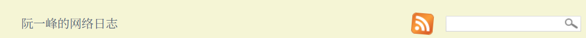
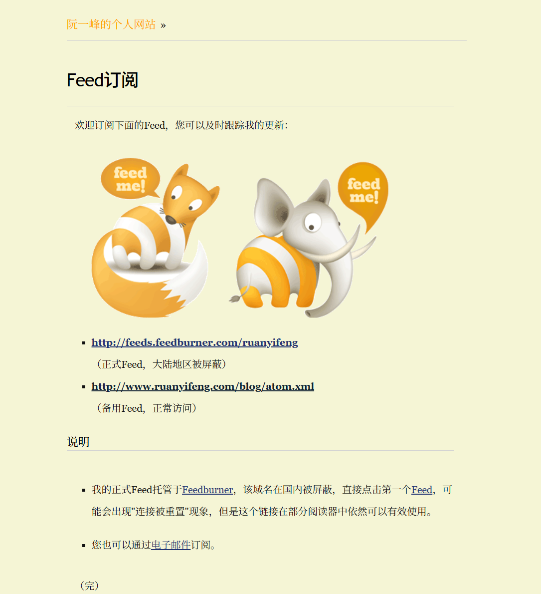
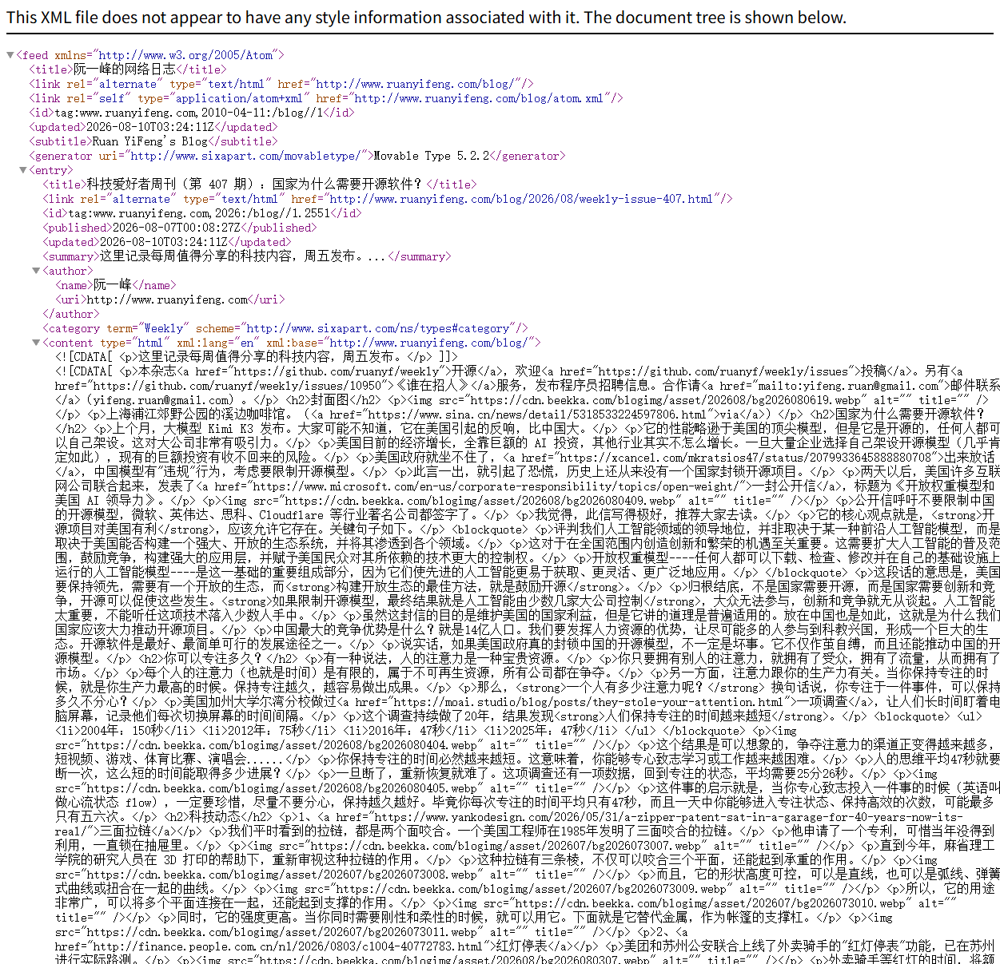
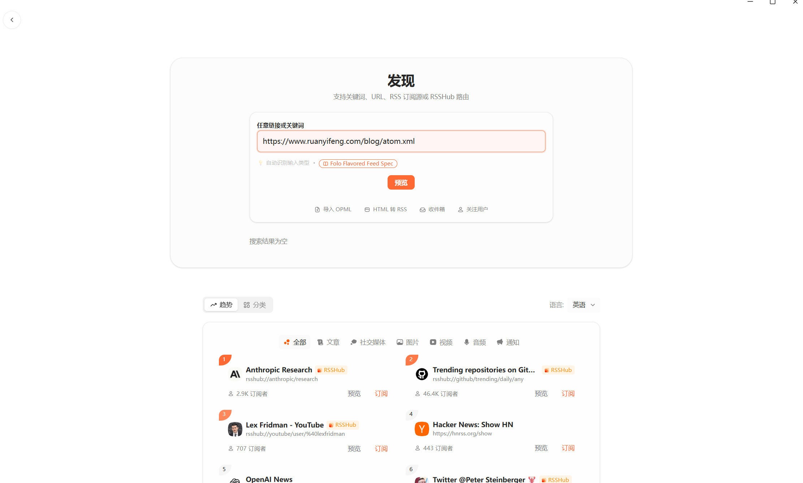
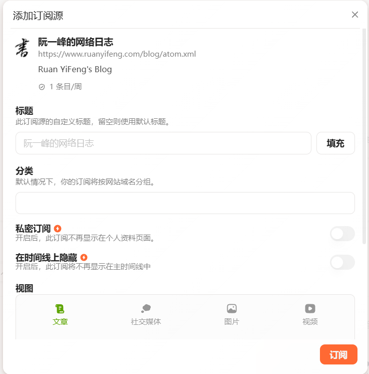

> ## What information consumes is rather obvious: it consumes the attention of its recipients. Hence a wealth of information creates a poverty of attention...
>
> <p style="text-align: right;">——Herbert A. Simon</p>


## 写在前面

本文是对**RSS**（Really Simple Syndication）这一信息获取技术的简要介绍以及使用体验分享，这一技术旨在解决信息推送铺天盖地、信息无穷无尽所带来的时间占用和焦虑感。如果你也沉迷于刷着无穷无尽的社媒、短视频等并想从中脱出，可以了解一下RSS这一“复古”技术。


## 什么是RSS

RSS 的全称有三种说法：
- RDF Site Summary（资源描述框架站点摘要）
- Rich Site Summary（网站内容摘要）
- Really Simple Syndication（简易资讯聚合）


它是一个能让你在**一个地方** （一个RSS阅读器） 订阅各种感兴趣**信息源**的工具，例如可以在一个APP中同时看：
+ 网站（新闻/博客/更新日志etc）
+ 公众号
+ B站up主更新
+ 知乎周榜

详细来说他有以下优势：

### 便利的信息聚合

例如我想关注歌手 吴青峰 的信息，我要同时关注他的 ins，facebook，微博……要在多个app中疲于切换和关注更新，而你只需要一个RSS阅读器（例如[folo](https://folo.is/))，就可以将这些信息聚合到一处，统一查看更新。

### 高度订制的个人信息流

在RSS阅读器中，**你只能看到你订阅的信息**：
+ 消息相对有限，不会被过量信息引发信息过多焦虑
+ 没有推送机制，不会“一刷就停不下来”大量占用时间
+ 个人精选信息来源，信息价值密度高

在如今所有社媒都在抢夺你的时间，通过推送算法为你推荐源源不断的信息，然而大部分都是碎片化的、价值低的，很容易让你浪费大量的时间。RSS提供了一个隔绝的信息孤岛，只允许你挑选的信息进入你的时间。

## RSS原理

RSS 的数据流转采用的是客户端主动拉取（Pull）机制，而非服务器推送（Push）。整个技术架构主要由三个关键部分构成：

1. **内容发布端（Publisher）**：网站的内容管理系统（CMS）在底层数据库有新内容生成时，会自动将最新内容按照 RSS 规范提取，并动态生成或静态写入一个 XML 格式的文件（通常称为 RSS Feed 或 RSS 源）。
    
2. **传输协议（Transport）**：该 XML 文件托管在标准的 Web 服务器上，通过 HTTP 或 HTTPS 协议暴露一个公开的 URL 供外部访问。
    
3. **内容聚合端（Aggregator/RSS Reader）**：客户端软件（即 RSS 阅读器）根据用户配置的订阅列表，按照固定的时间间隔（如每 30 分钟或每小时）向服务器端发起 HTTP 请求，下载该 XML 文件，并在本地解析、去重后呈现给终端用户。

信息源会生成一份xml文件，以[阮一峰老师的博客](https://www.ruanyifeng.com/blog/index.html)为例
``` xml
<feed xmlns="http://www.w3.org/2005/Atom">
<title>阮一峰的网络日志</title>
<link rel="alternate" type="text/html" href="http://www.ruanyifeng.com/blog/"/>
<link rel="self" type="application/atom+xml" href="http://www.ruanyifeng.com/blog/atom.xml"/>
<id>tag:www.ruanyifeng.com,2010-04-11:/blog//1</id>
<updated>2026-08-08T07:15:51Z</updated>
<subtitle>Ruan YiFeng's Blog</subtitle>
<generator uri="http://www.sixapart.com/movabletype/">Movable Type 5.2.2</generator>
<entry>
<title>科技爱好者周刊（第 407 期）：国家为什么需要开源软件？</title>
<link rel="alternate" type="text/html" href="http://www.ruanyifeng.com/blog/2026/08/weekly-issue-407.html"/>
<id>tag:www.ruanyifeng.com,2026:/blog//1.2551</id>
<published>2026-08-07T00:08:27Z</published>
<updated>2026-08-08T07:15:51Z</updated>
<summary>这里记录每周值得分享的科技内容，周五发布。...</summary>
<author>
<name>阮一峰</name>
<uri>http://www.ruanyifeng.com</uri>
</author>
<category term="Weekly" scheme="http://www.sixapart.com/ns/types#category"/>
<content type="html" xml:lang="en" xml:base="http://www.ruanyifeng.com/blog/">
<![CDATA[ <p>这里记录每周值得分享的科技内容，周五发布。</p> ]]>
<![CDATA[ <p>本杂志<a href="https://github.com/ruanyf/weekly">开源</a>，欢迎<a href="https://github.com/ruanyf/weekly/issues">投稿</a>。另有<a href="https://github.com/ruanyf/weekly/issues/10950">《谁在招人》</a>服务，发布程序员招聘信息。合作请<a href="mailto:yifeng.ruan@gmail.com">邮件联系</a>（yifeng.ruan@gmail.com）。</p> <h2>封面图</h2> <p></p> <p>上海浦江郊野公园的溪边咖啡馆。（<a href="https://www.sina.cn/news/detail/5318533224597806.html">via</a>）</p> <h2>国家为什么需要开源软件？</h2> <p>上个月，大模型 Kimi K3 发布。大家可能不知道，它在美国引起的反响，比中国大。</p> <p>它的性能略逊于美国的顶尖模型，但是它是开源的……
<!-- 下文省略 -->
```


## 如何使用RSS订阅

1. 选择或部署**RSS阅读器**（Fluent Reader、Folo、FeedDemon等）。
2. 获取你想订阅的信息源的**RSS订阅链接**
	阅读器需要目标网站提供的标准 XML 文件链接才能进行抓取。获取该链接的方式如下：
	- **原生支持的网站**：
    - **寻找标识**：在网站首页、底部导航栏或侧边栏寻找标准的 RSS 图标（通常为橙色背景带白色无线电波纹）。

    - **尝试通用路径**：许多网站（特别是基于 WordPress、Hexo 等构建的博客）拥有默认的 RSS 路径。可以尝试在域名后直接添加后缀，例如：
        
        - `[https://example.com/feed](https://example.com/feed)`
            
        - `[https://example.com/rss.xml](https://example.com/rss.xml)`
            
        - `[https://example.com/atom.xml](https://example.com/atom.xml)`
            
- **借助浏览器插件检测**：
    
    - 安装如 “RSSHub Radar” 或 “Get RSS Feed URL” 等浏览器扩展。当访问包含隐藏 RSS 链接的网页时，插件会自动解析 HTTP `head` 标签中的 `<link rel="alternate" type="application/rss+xml">` 信息并提取链接。
        
- **非原生支持网站的转换（RSSHub）**：
    
    - 对于本身不提供 RSS 源的动态网站或社交媒体平台（如微博、Bilibili、GitHub 动态等），可以通过开源项目 [**RSSHub**](https://rsshub.netlify.app/zh/) 动态生成 RSS 链接。
        
    - RSSHub 按照预设的路由规则，通过爬虫或 API 抓取目标网页数据，并将其转化为标准的 RSS 2.0 格式输出。
1. 在阅读器中配置订阅

### 以使用Folo订阅阮一峰老师的博客示例
打开[博客主页](https://www.ruanyifeng.com/blog/index.html)，在右上方能看到标志性的RSS订阅按钮，，点击跳转到订阅页面：




点击正式/备用Feed，会跳转到xml页面



复制该页面的**网址**，然后打开Folo发现页面导入




*ps. Folo自带发现功能，直接搜索阮一峰的网络日志也能找到，但大部分RSS阅读器还是需要通过xml链接导入*

**总结**：找到RSS链接->导入RSS订阅器。如果信息源不支持RSS（例如微信公众号/B站up主）则可以通过RSSHub等工具生成对应的RSS链接。

另：欢迎[订阅本博客！](https://lasuac-sg.github.io/rss.xml)

## 信息源推荐

已经有许多RSS整合推荐，如
+ [https://github.com/weekend-project-space/top-rss-list],[https://zhuanlan.zhihu.com/p/1996948845683290253]
等。

在这里我推荐一些自己目前在看的：
+ [github热门项目周榜](https://github.com/trending/?since=weekly&spoken_language_code=)
+ [Christopher Johnson的专栏](https://thatamazingprogrammer.com/)

	由资深开发者 Christopher Johnson 撰写的专栏，聚焦于软件工程哲学、代码规范、AI等。
+ [阮一峰的网络日志](https://www.ruanyifeng.com/blog/index.html)

	知名开发者阮一峰的个人博客。内容深入浅出，涵盖了技术周报、软件工程、科技趋势评论以及个人阅读思考，是中文圈极具影响力的技术博客。
+ 豆瓣小组-经典短篇阅读（使用RSSHub生成订阅）

	会更新一些中外短篇文学佳作，我订阅它希望能提升下我可怜的文学素养（）
+ [Electric Literature](https://electricliterature.com/)


	英文原文短篇文章，我用来提升英语水平。
+ [Agili的Hacker Podcast](https://hacker-podcast.agi.li/)

	一档利用 AI 技术驱动的 Hacker News 中文播客。它每天自动抓取 HN 上的热门硬核讨论，通过 AI 生成中文总结。因为我自己英文水平比较低，吃不消直接看大量的hacker news热门讨论，于是先通过这个播客寻觅，若找到感兴趣的讨论再去访问原帖。
+ [LinusTechTips 的 bilibili 空间](https://space.bilibili.com/12434430)
+ [小王Albert 的 bilibili 空间](https://space.bilibili.com/1140672573)
+ [Linksphotograph 的 bilibili 空间](https://space.bilibili.com/3816626)
+ [鹿羽图集 的 bilibili 空间](https://space.bilibili.com/113441116)

### Tips:
#### 精简信息源

信息源订阅不在多而在精。如果订阅了过多信息源、每天更新内容庞大，那么依然会造成信息焦虑，降低阅读欲望，APP内有大量的文章却不想阅读。反之，保持每日更新信息在可控范围内，更能坚持每天阅读这些优质内容。

#### 信息源多样性

RSS隔绝了垃圾信息，但也容易造成信息茧房，当你将个人信息源的制定从企业算法中夺回，便须精心设计你的信息组成。如同构建一个健康的投资组合：你不能只持有同一种资产。例如在关注计算机科学与技术动态的同时，配置一定比例的 UI/UX 设计趋势、社科人文探讨甚至完全陌生的跨界领域资讯。


## 结语

RSS的第一个正式版本发布于1999年，这样一个略显复古的协议却恰好能抵御现代信息洪流和平台壁垒。

如今社交平台都在最大化用户的停留时长，争夺用户的时间与注意力，通过推送机制挽留你、通过平台壁垒来阻止竞争对手。而 RSS 让用户赎回信息的控制权，并杜绝无意义内容对你时间的占用（例如你不会在RSS阅读器中长时间地刷垃圾短视频）。


如果你追求高信噪比、重视信息质量，或是想减少刷短视频、刷社媒的时间，亦或只是想方便的整合信息：试试RSS吧！